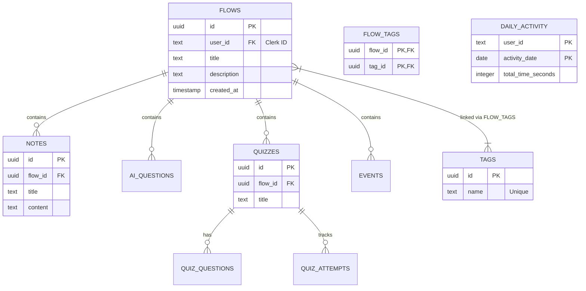

# Database Documentation & Architecture

This directory contains the core database configuration, schema definitions, and seeding logic for the **Note Flow Plus** application.

## Overview

The database uses **PostgreSQL** managed via **Drizzle ORM**. It is architected for speed, data integrity, and scalability, utilizing a normalized relational structure.

## Entity Relationship Diagram (ERD)

### Visual Diagram (Mermaid)

## Data Normalization Strategy

We follow **3rd Normal Form (3NF)** principles to ensure data integrity and minimize redundancy.

### 1. Tag Normalization (Many-to-Many)
Instead of storing tags as a comma-separated string inside the `flows` table (which is hard to search and update), we use a normalized approach:
- **`tags` table**: Stores unique tag names.
- **`flow_tags` table**: A junction table that links flows to tags.
- **Benefits**: Efficient filtering by tag, easy renaming of tags globally, and no data duplication.

### 2. Cascading Deletes
All child relationships (Notes, Quizzes, Events) use `onDelete: "cascade"`. 
- **Example**: If a user deletes a "Java Mastery" Flow, all related notes, quiz attempts, and tags associations are automatically cleaned up by the database level.

## Performance Optimization (Indexing)

To ensure the app remains fast as users add thousands of notes, we implemented a strategic indexing plan:

- **User-Scoped Queries**: An index on `flows.userId` ensures the main dashboard loads instantly.
- **Relationship Lookups**: Every foreign key column (e.g., `flowId`, `quizId`) is indexed. 
    - *Why?* When you open a flow, the query `SELECT * FROM notes WHERE flowId = ...` hits an index instead of scanning the entire notes table.

## Core Tables

| Table | Purpose |
| :--- | :--- |
| `flows` | The primary container for a learning path or project. |
| `tags` | A global repository of unique tags (Java, AI, React, etc.). |
| `notes` | Rich text documents linked to specific flows. |
| `quizzes` | Containers for practice questions. |
| `quiz_attempts` | Tracks user performance and learning progress over time. |
| `daily_activity` | Aggregated data for the user's heatmap/activity charts. |
| `events` | Deadline and schedule tracking for flow-related milestones. |

## Maintenance Commands

Located in `package.json`:
- `pnpm db:generate`: Generates migration files after schema changes.
- `pnpm db:push`: Pushes schema changes directly to the database.
- `pnpm db:studio`: Opens a visual GUI to explore your data.
- `pnpm db:seed`: Populates the database with initial mock data.
